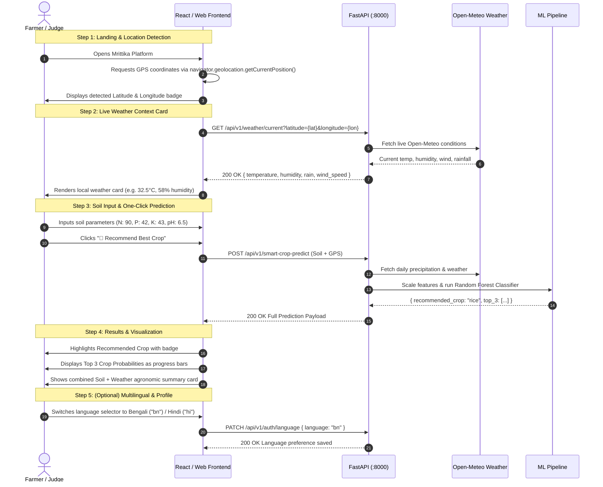

# Mrittika Full-Stack Integration Checklist

This document is the definitive integration guide for connecting the frontend with the FastAPI backend. All endpoints, schemas, and fields reflect the actual, running backend code.

---

## 1. Backend Base Configuration

- **Local Base URL:** `http://127.0.0.1:8000` (or `http://localhost:8000`)
- **API Version Prefix:** `/api/v1`
- **Swagger Documentation:** `http://127.0.0.1:8000/docs`
- **OpenAPI Schema:** `http://127.0.0.1:8000/openapi.json`
- **Content Type:** `application/json` for all POST and PATCH request bodies.

---

## 2. Authentication & JWT Token Management

### 2.1 How JWT Token is Returned
Upon successful login (`POST /api/v1/auth/login`), the backend returns a JSON envelope containing the token:

```json
{
  "success": true,
  "message": "Login successful",
  "data": {
    "access_token": "eyJhbGciOiJIUzI1NiIsInR5cCI6IkpXVCJ9...",
    "token_type": "bearer",
    "farmer": {
      "id": 1,
      "name": "Ramesh Kumar",
      "email": "farmer@example.com",
      "language": "bn"
    }
  }
}
```

- **Frontend Storage:** Store `data.access_token` in `localStorage` or session state (e.g., `localStorage.setItem("mrittika_token", res.data.access_token)`).

### 2.2 How JWT Token Must Be Sent
For protected endpoints (`/api/v1/auth/me`, `/api/v1/auth/language`), send the token in the standard HTTP `Authorization` header:

```http
Authorization: Bearer <access_token>
```

Example in Fetch API:
```javascript
fetch("http://127.0.0.1:8000/api/v1/auth/me", {
  headers: {
    "Authorization": `Bearer ${token}`
  }
});
```

---

## 3. Complete Endpoints Reference Table

| Feature | Method | Endpoint Path | Auth Required | Request Type | Status |
| :--- | :---: | :--- | :---: | :---: | :---: |
| **System Health** | `GET` | `/health` | No | None | Working |
| **Model Diagnostics** | `GET` | `/api/v1/health/model` | No | None | Working |
| **Farmer Signup** | `POST` | `/api/v1/auth/signup` | No | JSON Body | Working |
| **Farmer Login** | `POST` | `/api/v1/auth/login` | No | JSON Body | Working |
| **Current User Profile** | `GET` | `/api/v1/auth/me` | **Yes (Bearer)** | Headers | Working |
| **Update Language** | `PATCH` | `/api/v1/auth/language` | **Yes (Bearer)** | JSON Body | Working |
| **Smart Crop Prediction** | `POST` | `/api/v1/smart-crop-predict` | No | JSON Body | **Working (Core MVP)** |
| **Manual Crop Prediction**| `POST` | `/api/v1/crop-predict` | No | JSON Body | Working |
| **Current Weather (Live)**| `GET` | `/api/v1/weather/current` | No | Query Params | Working |
| **Weather Overview** | `GET` | `/api/v1/weather/weather` | No | Query Params | Working |

---

## 4. Endpoint Specifications: Exact Fields & Payloads

### 4.1 Smart Crop Prediction (Primary MVP Endpoint)
Automates weather fetching via Open-Meteo using the farmer's GPS coordinates and runs ML inference.

- **Endpoint:** `POST /api/v1/smart-crop-predict`
- **Request Fields:**
  | Field | Type | Validation / Allowed Range | Description |
  | :--- | :---: | :---: | :--- |
  | `N` | `float` | `0` to `1000` | Soil Nitrogen ratio |
  | `P` | `float` | `0` to `1000` | Soil Phosphorus ratio |
  | `K` | `float` | `0` to `1000` | Soil Potassium ratio |
  | `ph` | `float` | `0.0` to `14.0` | Soil pH level |
  | `latitude` | `float` | `-90.0` to `90.0` | Farmer GPS latitude |
  | `longitude`| `float` | `-180.0` to `180.0` | Farmer GPS longitude |

- **Request Example:**
  ```json
  {
    "N": 90.0,
    "P": 42.0,
    "K": 43.0,
    "ph": 6.5,
    "latitude": 22.5726,
    "longitude": 88.3639
  }
  ```

- **Important Response Fields:**
  | Response Path | Type | Description |
  | :--- | :---: | :--- |
  | `data.prediction.recommended_crop` | `string` | Top recommended crop (e.g. `"rice"`) |
  | `data.prediction.top_3` | `array[object]` | Top 3 crops: `[{"crop": str, "probability": float}]` |
  | `data.weather.temperature` | `float` | Live temperature in °C |
  | `data.weather.humidity` | `float` | Live relative humidity in % |
  | `data.weather.rainfall` | `float` | Daily precipitation sum in mm |
  | `data.soil` | `object` | Echoed soil parameters (`N`, `P`, `K`, `pH`) |

---

### 4.2 Manual Crop Prediction
Manual fallback when GPS is disabled or farmer wants custom weather inputs.

- **Endpoint:** `POST /api/v1/crop-predict`
- **Request Fields:**
  | Field | Type | Validation / Range | Description |
  | :--- | :---: | :---: | :--- |
  | `N` | `float` | `>= 0` | Nitrogen ratio |
  | `P` | `float` | `>= 0` | Phosphorus ratio |
  | `K` | `float` | `>= 0` | Potassium ratio |
  | `temperature` | `float` | `-50.0` to `60.0` | Temperature in °C |
  | `humidity` | `float` | `0.0` to `100.0` | Relative humidity % |
  | `ph` | `float` | `0.0` to `14.0` | Soil pH |
  | `rainfall` | `float` | `>= 0` | Rainfall in mm |

- **Important Response Fields:**
  | Response Path | Type | Description |
  | :--- | :---: | :--- |
  | `data.recommended_crop` | `string` | Recommended crop name |
  | `data.top_3` | `array[object]` | Array of 3 crops with probability scores |

---

### 4.3 Current Weather (Async Live Feed)
Used for the dashboard live weather widget.

- **Endpoint:** `GET /api/v1/weather/current?latitude={lat}&longitude={lon}`
- **Query Parameters:**
  - `latitude`: `float` (required)
  - `longitude`: `float` (required)

- **Important Response Fields:**
  | Response Path | Type | Description |
  | :--- | :---: | :--- |
  | `data.temperature` | `float` | Current temperature in °C |
  | `data.humidity` | `float` | Current humidity % |
  | `data.rainfall` | `float` | Precipitation |
  | `data.rain` | `float` | Rain |
  | `data.wind_speed` | `float` | Wind speed in km/h |

---

### 4.4 Weather Overview (Sync Feed)
- **Endpoint:** `GET /api/v1/weather/weather?latitude={lat}&longitude={lon}`
- **Query Parameters:** `latitude` (`float`), `longitude` (`float`)
- **Important Response Fields:**
  - `data.temperature`, `data.humidity`, `data.rainfall`

---

### 4.5 Farmer Signup
- **Endpoint:** `POST /api/v1/auth/signup`
- **Request Fields:**
  | Field | Type | Validation | Description |
  | :--- | :---: | :---: | :--- |
  | `name` | `string` | Min 2 chars | Farmer display name |
  | `email` | `string` | Valid email | Email address (unique) |
  | `password` | `string` | Min 6 chars | Plain text password |
  | `language` | `string` | Optional (default `"en"`) | Language code: `"en"`, `"bn"`, `"hi"`, `"or"`, `"mr"`, `"ml"` |

- **Important Response Fields:**
  - `data.id`, `data.name`, `data.email`, `data.language`

---

### 4.6 Farmer Login
- **Endpoint:** `POST /api/v1/auth/login`
- **Request Fields:**
  | Field | Type | Validation | Description |
  | :--- | :---: | :---: | :--- |
  | `email` | `string` | Valid email | Registered email |
  | `password` | `string` | Min 6 chars | Password |

- **Important Response Fields:**
  - `data.access_token`: JWT string
  - `data.token_type`: `"bearer"`
  - `data.farmer`: `{ id, name, email, language }`

---

### 4.7 Current User Profile (`/auth/me`)
- **Endpoint:** `GET /api/v1/auth/me`
- **Header:** `Authorization: Bearer <access_token>`
- **Important Response Fields:**
  - `data.id`: `int`
  - `data.name`: `string`
  - `data.email`: `string`
  - `data.language`: `string`

---

### 4.8 Update Farmer Language
- **Endpoint:** `PATCH /api/v1/auth/language`
- **Header:** `Authorization: Bearer <access_token>`
- **Request Fields:**
  | Field | Type | Allowed Values |
  | :--- | :---: | :--- |
  | `language` | `string` | `"en"` (English), `"bn"` (Bengali), `"hi"` (Hindi), `"or"` (Odia), `"mr"` (Marathi), `"ml"` (Malayalam) |

- **Important Response Fields:**
  - `data.id`, `data.language`

---

## 5. CORS Configuration & Requirements

The backend `CORSMiddleware` in `main.py` is configured with:
- `allow_credentials = True`
- `allow_methods = ["*"]`
- `allow_headers = ["*"]`

### Pre-Configured Allowed Origins
The backend automatically permits all standard local development servers:
- `http://localhost:5173` & `http://127.0.0.1:5173` (Vite)
- `http://localhost:3000` & `http://127.0.0.1:3000` (Create React App / Next.js)
- `http://localhost:5500` & `http://127.0.0.1:5500` (VS Code Live Server)
- Any additional origins defined in `.env` under `FRONTEND_URL`.

**Frontend Requirement:** Use standard `fetch` or `axios`. No proxy configuration is required; direct requests to `http://127.0.0.1:8000` will succeed.

---

## 6. Expected Frontend → Backend Demo Flow

For a winning hackathon presentation, implement this high-impact 5-step flow:



---

## 7. Frontend Integration Quick Checklist

- [ ] **Base URL Config:** Set API base URL constant to `http://127.0.0.1:8000`.
- [ ] **Geolocation Handler:** Use `navigator.geolocation.getCurrentPosition` with fallback coordinates (e.g., `22.5726`, `88.3639` for Kolkata / West Bengal).
- [ ] **Soil Form Defaults:** Provide sensible initial values: `N: 90`, `P: 42`, `K: 43`, `ph: 6.5`.
- [ ] **Envelope Handler:** Extract payloads from `response.data.data` (FastAPI envelope pattern: `{ success, message, data }`).
- [ ] **Error Toast / Banner:** Handle HTTP `422` (validation errors) and HTTP `502`/`503` (weather service unavailable).
- [ ] **Auth Token Header:** If implementing user login, store `access_token` and pass `Authorization: Bearer <token>` in requests to `/api/v1/auth/me`.
